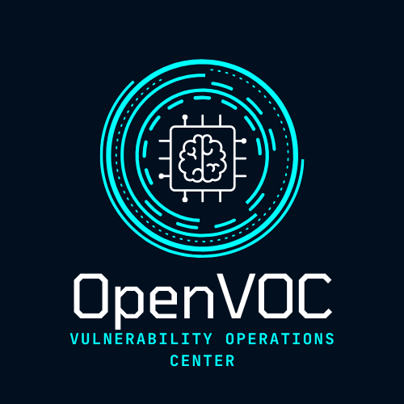
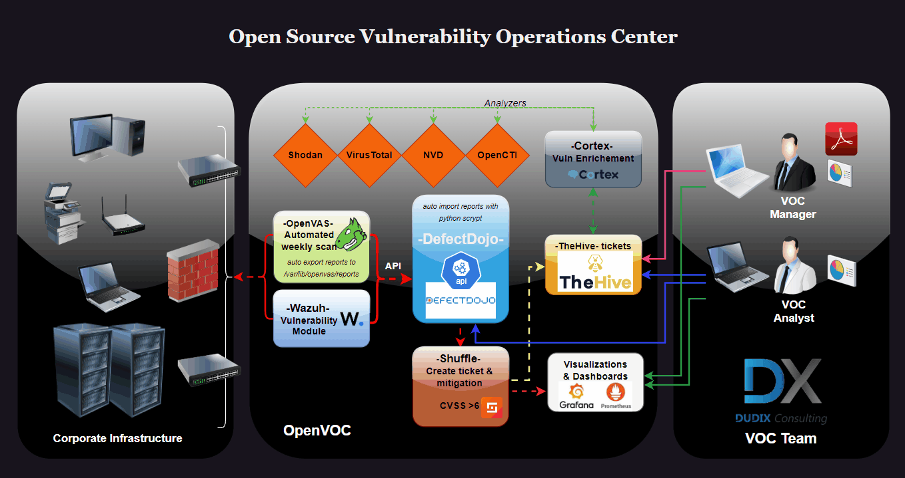

# OpenVOC - Open Source Vulnerability Operations Center

##
**A VOC (Vulnerability Operations Center) is a dedicated unit or structure focused on the centralized management of IT security vulnerabilities within an organization. It is a concept similar to a SOC (Security Operations Center) but specifically oriented toward the proactive and reactive management of security flaws.**

##
Here is a detailed explanation of its primary functions:

**Monitoring and Detection of Vulnerabilities**

- Collecting information on vulnerabilities (via tools such as Nessus, Qualys, or OpenVAS, as well as databases like NVD or CVE).
- Monitoring security advisories issued by software and hardware vendors.
- Identifying vulnerabilities present in the organization’s IT infrastructure.

**Assessment and Prioritization**

- Analyzing risks associated with each vulnerability, considering the organizational context.
- Prioritizing actions based on criteria such as severity (CVSS score), criticality of affected assets, and ease of exploitation.

**Remediation**

- Coordinating corrective actions, such as applying patches (patch management), updating configurations, or implementing compensatory measures.
- Collaborating with operations and development teams to avoid operational conflicts.

**Automation and Tools**

- Integrating vulnerability management tools into the SIEM or SOAR environment.
- Automating repetitive tasks, such as regular system scans and ticket creation for tracking remediations.

**Communication and Reporting**

- Generating reports for management or stakeholders, highlighting trends, recurring weaknesses, and the status of remediations.
- Raising awareness among teams about security best practices and the impact of vulnerabilities.

**Proactivity and Strategy**

- Tracking emerging trends in cybersecurity (zero-days, new attack techniques).
- Conducting simulations and exercises to enhance resilience against attacks exploiting known vulnerabilities.
##

**Why Is a VOC Essential?**

With the rise of cyber threats and the growing complexity of systems, a VOC provides:

- A fast and organized response to critical vulnerabilities.
- Reduced exposure times, limiting the risk of exploitation.
- Better visibility into the organization's overall security posture.

##
**The initial diagram**

  
